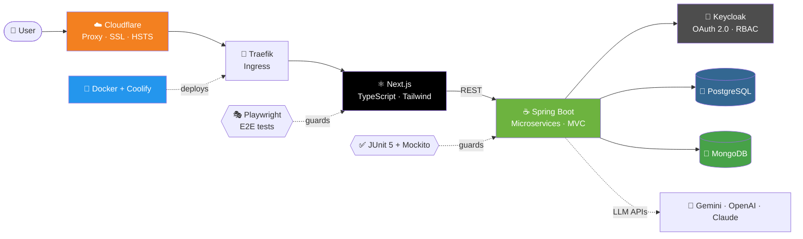

<div align="center">


<a href="https://github.com/pawanbulathwaththa">
  
</a>

<br/>


[](https://pawanbulathwaththa.github.io/my_portfolio)
[](https://linkedin.com/in/pawan-bulathwaththa-99a51733b)
[](mailto:pawanbulatwaththa@gmail.com)

</div>

---

## 🌱 `Application Started`

Like a Spring Boot app, this profile boots up with a banner. Scroll to see what's running. 👇

```text
  .   ____          _            __ _ _
 /\\ / ___'_ __ _ _(_)_ __  __ _ \ \ \ \
( ( )\___ | '_ | '_| | '_ \/ _` | \ \ \ \
 \\/  ___)| |_)| | | | | || (_| |  ) ) ) )
  '  |____| .__|_| |_|_| |_\__, | / / / /
 =========|_|==============|___/=/_/_/_/
 :: Pawan Bulathwaththa ::          (v2026.0.1)

 INFO  --- Starting Developer on Colombo, LK with PID 1337
 INFO  --- Active profile(s): fullstack, backend-leaning, curious
 INFO  --- Loading beans: Java ✓  TypeScript ✓  PostgreSQL ✓  Docker ✓
 INFO  --- Keycloak realm connected ✓  OAuth2 tokens flowing ✓
 INFO  --- Playwright watching for regressions 👀
 INFO  --- Started Pawan in 3.2 seconds (JVM running for ∞ ambition)
 HTTP  --- GET /hire-me  →  200 OK 🟢  (open to opportunities)
```

---

## 👨‍💻 `GET /about`

```java
@Entity
public class Pawan implements Developer {

    private String role      = "Associate Software Engineer";
    private String location  = "Colombo, Sri Lanka 🇱🇰";
    private String studying  = "BSc (Hons) CS with Software Engineering, Coventry University";
    private String baseCamp  = "NIBM City University (Kandy)";

    private List<String> superpowers = List.of(
        "Enterprise backends with Spring Boot",
        "Modern UIs with Next.js + TypeScript",
        "Secure auth with Keycloak & OAuth 2.0",
        "Containers, VPS, Traefik & Cloudflare",
        "End-to-end testing that actually catches bugs"
    );

    public String currentlyExploring() {
        return "Agentic AI · Model Context Protocol (MCP) · LLM integration";
    }

    public String funFact() {
        return "Built a talking, gesture-controlled robot powered by Gemini AI 🤖";
    }
}
```

---

## 🏗️ `My Typical Architecture`

> The kind of system I like to ship, from the browser all the way to a secured, containerized production edge.



---

## 🧰 `Tech Stack`

<div align="center">

### 🔙 Backend


### 🎨 Frontend


### 🗄️ Databases


### 🧪 Testing & Quality


### ☁️ DevOps & Infra


### 🤖 AI & Tooling


</div>

---

## 🎮 `Skill Levels` (RPG style)

```text
☕ Java / Spring Boot    ████████████████████░░  Lv. 18  "Backend Knight"
⚛️ Next.js / TypeScript  ██████████████████░░░░  Lv. 16  "Frontend Mage"
🔐 Keycloak / OAuth2     ████████████████░░░░░░  Lv. 14  "Gatekeeper"
🎭 Playwright / JUnit    ████████████████░░░░░░  Lv. 14  "Bug Slayer"
🐳 Docker / Traefik / VPS███████████████░░░░░░░  Lv. 13  "Ship Captain"
🤖 LLMs / MCP / Agents   █████████████░░░░░░░░░  Lv. 11  "Apprentice Wizard" (levelling up fast)
```

---

## 🚀 `git log --career`

```text
* a1b2c3d (HEAD -> main) 🧑‍💻 Associate Software Engineer path | Feb 2026 → present
|   Trainee Software Engineer @ DvTechLabs (Pvt) Ltd, Colombo
|   ├─ Shipped full-stack SaaS & e-commerce features (Spring Boot · Next.js · PostgreSQL)
|   ├─ Built secure auth & RBAC with Keycloak + OAuth 2.0
|   ├─ Wrote JUnit 5 / Mockito suites + Playwright E2E regression tests
|   ├─ Architected an isolated staging env on Linux VPS (Docker · Coolify · Traefik)
|   ├─ Locked down the edge: Cloudflare proxy, full SSL termination, strict HSTS
|   └─ Optimized containerized builds for Spring Boot & Next.js (less memory, faster deploys)
|
* e4f5a6b 🎓 BSc (Hons) CS with Software Engineering, Coventry University | 2026
* 7c8d9e0 📘 Higher Diploma in Software Engineering, NIBM | 2024 – 2025
* 1a2b3c4 📗 Diploma in Computer System Design, NIBM | 2023 – 2024
* 0000000 🌱 Initial commit: "hello, world"
```

---

## 🏆 `Featured Projects`

<table>
<tr>
<td width="50%" valign="top">

### 🛒 udaratacomputers.lk
*Live e-commerce platform for a computer store*

Took a local business online so it can sell through its own website.


</td>
<td width="50%" valign="top">

### 🏛️ Smart Hall Management System
*Automatic hall allocation with zero scheduling conflicts*

Role-based access for admins, lecturers and students, secured with Keycloak + OAuth 2.0.


</td>
</tr>
<tr>
<td width="50%" valign="top">

### 🤖 Talking Robot with Gemini AI
*Gesture-controlled robot you can actually have a conversation with*

Custom prompt handling, context framing and structured responses for real-time, voice-based Q&A.


</td>
<td width="50%" valign="top">

### 💧 Smart Water Management System
*IoT platform with an autonomous water controller*

Monitors water quality and manages household usage through web and mobile apps.


</td>
</tr>
<tr>
<td width="50%" valign="top">

### 🔧 FixMyRide
*Breakdown? Find the nearest mechanic.*

Mobile and web app with backend APIs and a smooth user workflow.


</td>
<td width="50%" valign="top">

### 🍔 UrbanFood System
*Full-stack food ordering platform*

Catalog, cart and order management. Oracle for core data, MongoDB for reviews and ratings.


</td>
</tr>
<tr>
<td width="50%" valign="top">

### 🚗 Vehicle Ordering System
*Customer, dealer and admin panels in one platform*

Authentication, data management and backend business logic.


</td>
<td width="50%" valign="top">

### ❤️ Heart Disease Prediction Model
*Machine learning on patient data*

Data preprocessing and model evaluation in Python.


</td>
</tr>
</table>

---

## 🎭 `Test Report` (yes, my README has a test suite)

```text
$ npx playwright test --project=pawan

Running 7 tests using 1 worker

  ✓ [pawan] › writes clean, SOLID code                        (always)
  ✓ [pawan] › designs REST APIs people enjoy using            (1.2s)
  ✓ [pawan] › secures apps with Keycloak & OAuth 2.0          (0.9s)
  ✓ [pawan] › deploys to Linux VPS with Docker + Traefik      (2.1s)
  ✓ [pawan] › leads teams (President, Media Club NIBM Kandy)  (2024-25)
  ✓ [pawan] › learns new tech faster than npm installs it     (0.3s)
  ✓ [pawan] › survives code review with a smile 😄            (∞)

  7 passed (0 flaky, 0 skipped)
```

---

## 🧠 `Currently Levelling Up`

| 🎯 Focus | 📌 What I'm doing |
|---|---|
| 🤖 **Agentic AI** | Autonomous agent workflows with the **Model Context Protocol (MCP)**, structured tool/resource invocation and context orchestration |
| 🧬 **LLM Integration** | Gemini · OpenAI · Claude APIs, prompt engineering, vector databases (basics) |
| 🏛️ **Architecture** | Clean Architecture, SOLID, microservices patterns |
| ⚙️ **CI/CD** | Faster, leaner, repeatable deployment pipelines |

---

## 🤝 `Beyond the Code`

- 🎙️ **President**, Media Club of NIBM Kandy (2024 – 2025)
- ✍️ **Editor**, Rotaract Club of NIBM Kandy (2024 – 2025)
- 💻 **Active Member**, IT Society of NIBM Kandy (2023 – 2025)
- 🎨 Comfortable in Figma and UI/UX design, so I can sit between design and engineering

---

## 📊 `GitHub Analytics`

<div align="center">


<br/>


<br/>


<br/><br/>


</div>

---

## 📬 `POST /contact`

```http
POST /contact HTTP/1.1
Host: pawanbulathwaththa.github.io
Content-Type: application/json

{
  "name": "Pawan Bulathwaththa",
  "email": "pawanbulatwaththa@gmail.com",
  "linkedin": "linkedin.com/in/pawan-bulathwaththa-99a51733b",
  "portfolio": "pawanbulathwaththa.github.io/my_portfolio",
  "location": "Colombo, Sri Lanka",
  "interests": ["Backend engineering", "Full-stack products", "Cloud-native delivery", "Agentic AI"],
  "message": "Got an interesting problem? Let's build it."
}

HTTP/1.1 200 OK ✅  (typical response time: fast)
```

<div align="center">

<br/>

### ⭐ *"First, solve the problem. Then, write the code."*

<br/>


</div>
